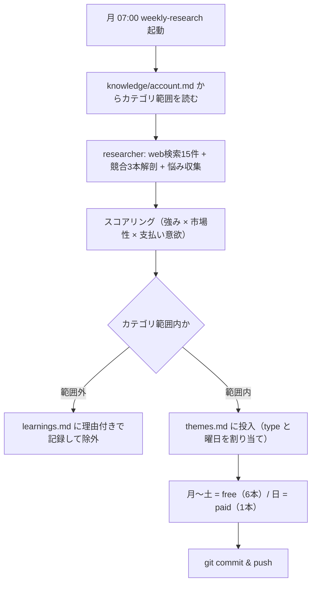
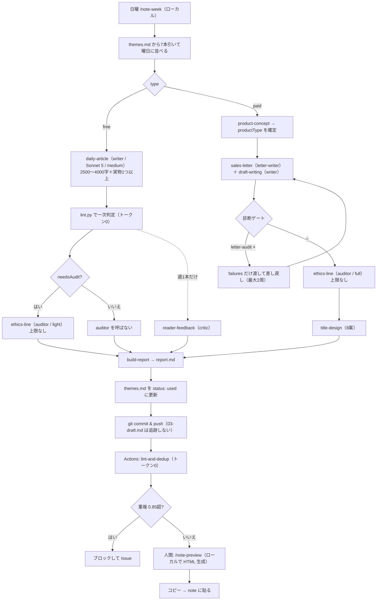

# note-factory アーキテクチャ v3.0

仕様書: [note-factory-spec.md](./note-factory-spec.md) / 運用ルール: [CLAUDE.md](./CLAUDE.md)

このドキュメントは「なぜこの構造になっているか」を記す。手順や使い方は [README.md](./README.md) を参照。

> ## ⚠ 2026-08-07 の改訂で変わった点
>
> **以下の記述はこのドキュメントでは更新していない。正典は [CLAUDE.md](./CLAUDE.md) である。**
> 経緯は [knowledge/learnings.md](./knowledge/learnings.md) の「カテゴリ改訂の記録」にある。
>
> | 項目 | このドキュメントの記述 | 現行 |
> |---|---|---|
> | 主カテゴリ | Claude Code の運用と保守 | **GAS と生成AI で「他人に渡せる自動化システム」を作る**（第3版・2026-08-21） |
> | 週の形 | 独立した7本 | **1つの自動化システムを7分割した連載**（日曜に完成版一式を有料で渡す） |
> | 無料記事の文字数 | 1500〜2500字 | **2500〜4000字**（本文のみ。実物は別） |
> | `reader-feedback` | 無料記事に毎回1周 | **週1本だけ**（日曜にサンプリング） |
> | `ethics-line`（無料記事） | 毎回実行 | **`lint.py` の一次判定で検出時のみ** |
> | 市場調査 | web 検索15件 | **`note_market.py` の実測**＋検索5件 |
> | 実物 | 要求なし | **全記事に必須**（`lint.py` の `no-artifact`） |
> | 見出し画像 | 手作業 | `thumbnail-prompt` がプロンプトを作る（`06-thumbnail.md`） |
> | ダッシュボード | デモデータ | **実測値**（`note_market.py --write-dashboard`） |
>
> **判定を消したのではなく、LLM から決定論コードへ移した。**
> 浅い記事はレビューでは直らず、テーマ選定の時点で決まっているという判断による。

---

## 1. 設計の前提

### 1.1 解こうとしている問題

副業のコンテンツ販売が続かないのは意志力ではなく設計の問題である。ネタ探し・構成・執筆・校正・レイアウト・告知・導線を1人の頭で同時並行しているから止まる。

### 1.2 人間に残す仕事は2つだけ

| 人間 | 機械 |
|---|---|
| プレビュー画面から本文をコピーして note に貼る | 調査・リサーチ・分析・テーマ決定・記事生成のすべて |
| ダッシュボードで管理する | 数値取得・診断・打ち手の提示 |

この前提から2つの制約が導かれる。

- **確認を求めるために処理を止めない。** 止めてよいのは入力ファイルが欠けているときだけ。
- **人が見ないぶん、機械が自分を落とす仕組みが要る。** → §5 の品質ゲート

### 1.3 v3.0 が解いた3つの制約

v2.0（週1本の有料note）から週7本へ移行するにあたり、3つの制約が同時に効いてきた。それぞれに対する解が v3.0 の骨格を作っている。

| 制約 | 解 | 節 |
|---|---|---|
| **トークンが足りない**（Pro = $20/月） | リサーチを週次に集約し、決定論で判定できるものをコードへ移す | §2.2, §4 |
| **実績（`profile.md`）が空** | 商品の型を分け、道具型は成果物の検証可能性で再現性を担保する | §3.3 |
| **ブラウザ自動操作が重く不安定** | HTML にレンダリングして人間がコピペする | §10 |

---

## 2. レイヤ構造

v2.0 は部署（リサーチ部・編集部・営業部）で分けていた。v3.0 は**周期**で分ける。

```
┌─ 週次リサーチ層（ローカル / 日曜）──────────────────────────┐
│  weekly-research                                             │
│  → web検索・競合解剖・スコアリング → themes.md に7本仕込む   │
│  → ここでしか web 検索をしない                               │
└──────────────────────────────────────────────────────────────┘
              ↓ 在庫（research/themes.md）
┌─ 週次生成層（ローカル / 日曜1回）───────────────────────────┐
│  /note-week（weekly-build）                                  │
│  → 在庫から7本引く。無料6本は writer を並列起動して書く      │
│  → 日曜の1本だけ paid。web 検索をしない                      │
└──────────────────────────────────────────────────────────────┘
              ↓ notes/{slug}/ に push
┌─ 決定論ゲート層（GitHub Actions / トークン0）───────────────┐
│  lint.py    文体・表記・note で崩れる記法                    │
│  dedup.py   既出記事との重複（TF-IDF）                       │
└──────────────────────────────────────────────────────────────┘
              ↓
┌─ 受け渡し層（ローカル / localhost:5173）────────────────────┐
│  build-preview.mjs → serve.mjs                               │
│  → note 互換 HTML ＋ 書式付きコピーボタン                    │
└──────────────────────────────────────────────────────────────┘
```

その下に、v2.0 から変わらない2層が敷かれている。

```
┌─ Subagents（独立コンテキスト）── 5体 ───────────────────────┐
│  researcher / writer / letter-writer / critic / auditor      │
│  → 何を見せないかが設計の本体                                │
└──────────────────────────────────────────────────────────────┘
┌─ Skills（判断基準の定義）── 15本 ───────────────────────────┐
│  → 生成手順ではなく「良し悪しを決める物差し」を持つ          │
└──────────────────────────────────────────────────────────────┘
```

### 2.1 なぜ周期で分けたのか

**日次リサーチはトークンが持たないからである。**

v2.0 は `daily-trend-scan` を毎朝走らせる設計だった。1回あたり約66円、月30回で約2,000円。Pro プラン（$20 ≈ 3,000円）の3分の2をリサーチだけで使い切る。

週次に集約すると月250円になり、**削減額の1,750円がそのまま記事26本分の原資になる。** 週1本しか出せなかったものが週7本になる転換点がここにある。

### 2.2 Routines を廃止した

初版は `daily-build` / `weekly-research` / `monthly-review` の3本を Anthropic クラウドの Routines に置いていた。**すべて廃止し、ローカル実行に移した。**

**ただし `routines/` の削除では止まらなかった。** 登録は claude.ai 側にあるため、`daily-build` と `weekly-research` は削除後も走り続け、2026-08-19 に `enabled: false` にして初めて止まった。完全な削除は https://claude.ai/code/routines から行う。

| 廃止の理由 | 内容 |
|---|---|
| **有料noteを手元に残せない** | `03-draft.md` は `.gitignore` 対象。クラウドで生成するとコミットされず消える（§11.2） |
| **日次で起こす必要が消えた** | 生成を日曜1回にまとめたため、毎日クラウドを動かす意味が無い |
| 公開版の暗号化ができない | `03-draft.md` が Actions 上に存在しないため、暗号化もローカルでしか行えない |

### 2.3 週次の実行（すべてローカル）

| # | 実行 | タイミング | 頻度 |
|---|---|---|---|
| 1 | `weekly-research` | 日曜（在庫が7本未満のとき） | 週次 |
| 2 | **`/note-week`（weekly-build）** | **日曜。`market-research`（21時）のあと** | **週次** |
| 3 | `/note-preview` | `/note-week` の直後 | 週次 |
| 4 | `/note-review` | 月初 | 月次 |

**日曜に人間がやることは2コマンドだけである。** `/note-week` と `/note-preview`。

**7本を1回で作れる理由:** `themes.md` の各テーマが `type`（free / paid）と曜日を持つため、在庫から7本引いて曜日に並べるだけでよい。無料6本は互いに独立しているので `writer` サブエージェントを並列起動できる。

### 2.4 GitHub Actions で記事を生成しない

Claude Code Action は Anthropic API キーによる従量課金であり、**サブスク枠の外**になる。生成はすべてローカルに置き、Actions は LLM を使わない処理だけを担当する。

public repo なので Actions の実行時間は無制限。ただし**公開版プレビューの生成は Actions に置かない**。暗号化には `03-draft.md` が要るが、それは `.gitignore` 対象で Actions 上に存在しないためである（§10.3）。

---

## 3. スキル一覧（全15本）

v2.0 の26本から14本を削減した。行き先は [仕様書 付録A](./note-factory-spec.md) を参照。

### 3.1 リサーチ層（4本）

| # | スキル | 判断基準 | 出力 |
|---|---|---|---|
| R1 | `account-research` | **フォロワー数では評価しない。** スキ率・投稿頻度・参入時期・有料noteの型で見る | `research/accounts/{genre}.md` |
| R2 | `account-design` | 主カテゴリ1つ＋サブ2〜3つを確定。**人間に聞かない** | `knowledge/account.md` |
| R3 | `weekly-research` | 週1で7本を `type` と曜日付きで仕込む。**カテゴリ範囲外は在庫に入れない** | `research/themes.md` |
| R4 | `pricing-strategy` | 情報密度と価格の対応。**天井を下げる判断**を含む | 価格 + 根拠 |

**R1 がフォロワー数で評価しない理由:** フォロワー数は参入時期と交絡している。2020年から書いている人のフォロワー数は、いま参入して勝てるかどうかを何も語らない。スキ率のほうがアカウントの質を正直に表す。

### 3.2 生成層（9本）

| # | スキル | 判断基準 | 起動 |
|---|---|---|---|
| E1 | `daily-article` | **2500〜4000字。実物（プロンプト全文／コード全文／before-after）を必ず1つ持たせる** | 無料記事 |
| E2 | `product-concept` | 強み × 競合の穴 × 深層心理の交点を1文で。**`productType` を確定**。構成も決める | 有料note |
| E3 | `sales-letter` | 理想の未来と再現性を交互に配置。恐怖は1つだけ | 有料note |
| E4 | `draft-writing` | 有料部分。道具型では**動作条件と最初の1歩**を必ず書く | 有料note |
| E5 | `letter-audit` | 16項目を○×判定。**上限2周** | 有料note |
| E6 | `ethics-line` | 偽の限定・盛った恐怖・裏付けのない体験談 | **有料note必須／無料は `lint.py` の検出時のみ** |
| E7 | `reader-feedback` | ペルソナになりきって離脱ポイントを検出 | 無料記事（**週1本だけ**） |
| E8 | `title-design` | 5タイプ×8案を生成して採点 | 有料note |
| E9 | `build-report` | 判断ログを1枚に | 全記事 |

日次（無料記事）で動くのは **E1 / E6 / E7 / E9 の4本だけ**である。

### 3.3 商品の型（v3.0 の中核変更）

**有料noteには2つの型がある。混同すると `letter-audit` が構造的に通らない。**

| 型 | 再現性の根拠 | `profile.md` | 例 |
|---|---|---|---|
| `tool`（道具型） | **成果物そのものの検証可能性** | **不要** | スキル定義集、プロンプト集、設計図 |
| `experience`（体験談型） | 書き手の実績 | **必須** | 「月5万を達成した手順」 |

v2.0 の `sales-letter` は体験談型を暗黙の前提にしていた。実績がないと以下が必ず落ちる。

| ブロック | `experience` | `tool` |
|---|---|---|
| 再現性③ | 天井を下げる ＋ 自分以外の結果 | **成果物の中身を開示 ＋ 動作条件を明記** |
| 再現性④ | 共感（ダメだった頃の話） | **この道具がなかったときに何が面倒だったか** |
| `letter-audit` C2 | 天井を下げたか / 自分以外の結果があるか | **開示したか / 最初の1歩を踏めるか / 動作条件を書いたか** |

道具型は再現性の根拠を「書き手の過去」ではなく「成果物の検証可能性」に置く。買った人が手元でコピペして動かせるかどうかが証明であり、書き手が何者かは関係ない。

**副次的な利点:** 道具型は「必ず稼げる」と書く必要がないため、`ethics-line` の E5（収益の断定表現）が構造的に発生しない。数字を主張しないため E3（裏付けのない実績）も回避される。**「創作しない」ルールとリスクの方向が一致している。**

### 3.4 経営層（2本）

| # | スキル | 役割 |
|---|---|---|
| C1 | `profile-accumulator` | 週次で `data/` と `report.md` から「言える実績」を `profile.md` に追記。**創作しない** |
| C2 | `revenue-maximizer` | 顧客数 × 単価 × 購入回数 のボトルネック診断 |

**C1 が v3.0 の要である。** 実績のない状態から始めて、運用そのものを実績に変換する。数ヶ月後には `type: experience` を書ける材料が揃う。

---

## 4. 決定論ゲート層

**決定論で判定できるものを LLM に考えさせない。** これが v3.0 のコスト設計の中核である。

「すべてのスキルは物差しを持つ」という原則は維持したまま、**物差しの実装を LLM からコードへ移す。**

### 4.1 `scripts/lint.py`（依存なし）

| 検出項目 | 基準 |
|---|---|
| 一文の長さ | 60文字超で警告、100文字超でエラー |
| 漢字かな比率 | 漢字40%超で警告 |
| 表記ゆれ | ですます／である混在、送り仮名の不統一 |
| 禁止表現 | `voice.md` の `ng` ブロック |
| 見出し階層 | H1 重複、H2 を飛ばした H3 |
| **note で崩れる記法** | **テーブル・脚注・3階層以上のリスト** |

v2.0 の `proofreading`（E7）と `note-layout`（E8）をここに吸収した。

### 4.2 `scripts/dedup.py`（文字3-gram TF-IDF / 依存なし）

日本語は分かち書きが必要なため単語 TF-IDF は形態素解析に依存する。
代わりに**文字3-gram**の TF-IDF を使う。日本語の短文類似度では文字 N-gram のほうが安定し、
依存ライブラリも要らない。

比較前に**コードブロックを除去する。** 同じライブラリを扱う記事はコードが似るため、
残すと無関係な記事まで高い類似度になる。

| 類似度 | 措置 |
|---|---|
| 0.85 超 | **ブロック**。Actions を失敗させ Issue |
| 0.70〜0.85 | 警告。`report.md` に記録して通す |
| 0.70 未満 | 通す |

**毎日投稿で最も現実的な事故はネタの反復である。** 3週間で同じことを言い始める。LLM で判定すると毎回トークンを食うが、コードなら実行時間数秒・トークン0で済む。

### 4.3 有料部分は Actions で検査できない

`03-draft.md` は追跡しないため（§11.1）、GitHub Actions 上には存在しない。**有料部分の文体チェックと重複チェックはローカルで走らせる。**

`/note-preview` の実行時に `lint.py` / `dedup.py` をローカル実行し、結果をプレビュー画面に表示する。週2本なので手動運用で足りる。

---

## 5. 品質ゲート（判断ゲート層）

| ゲート | 見るもの | 対象 | 上限 | 実行 |
|---|---|---|---|---|
| `lint.py` | 文体・記法・**実物の有無**・**実績主張** | 全記事 | — | Actions（**トークン0**） |
| `dedup.py` | 重複 | 全記事 | 0.85でブロック | Actions（**トークン0**） |
| `note_market.py` | 需要と供給。テーマ選定の根拠 | 週次 | — | Actions（**トークン0**） |
| `reader-feedback` | 離脱しないか | 無料記事 | **週1本だけ** | `critic` |
| `letter-audit` | 売れるか（16項目） | 有料note | 2周 | `critic` |
| **`ethics-line`** | やってはいけないことをしていないか | **有料note必須／無料は検出時のみ** | **上限なし** | `auditor` |

### 5.0 レビューを削り、テーマ選定に投資する（2026-08-07 改訂）

**浅い記事はレビューでは直らない。テーマ選定の時点で決まっている。**

初版はレビューに週10回の LLM 呼び出しを注ぎ、テーマ選定には web 検索15件しか
使っていなかった。その結果、需要÷供給 0.064 の領域に突っ込んだ。

配分を逆にした。**判定を消したのではなく、LLM から決定論コードへ移した。**

| 判定 | 移す前 | 移した後 |
|---|---|---|
| E5（断定表現） | `auditor` が毎回読む | `voice.md` の `ng` を `lint.py` が部分一致で検出 |
| E3（裏付けのない実績） | 同上 | `lint.py` の `unverified-claim` が拾い、**拾ったときだけ** `auditor` |
| 実物の有無 | 判定なし | `lint.py` の `no-artifact`（**error**） |
| 市場性 | web 検索の印象 | `note_market.py` の実測（需要÷供給） |

**漏れるもの:** 数値を伴わない婉曲な実績主張は機械では拾えない。
週1本の `reader-feedback` と月次レビューで検出する。漏れを承知でコストを取っている。

### 5.1 `ethics-line` だけ上限がない理由

景品表示法・特定商取引法に関わるため。他は品質の問題だが、これは法的な問題である。妥協しない。

**モデルは下げない。** 減らしたのは呼ぶ**回数**であって精度ではない。

焦らせる演出そのものは白。**嘘の期限だけがアウト**という線引きで判定する。

### 5.2 モード分岐

| モード | 対象 | 検出項目 |
|---|---|---|
| `full` | 有料note | E1〜E5 の全5項目 |
| `light` | **無料記事** | **E3（裏付けのない実績）と E5（断定表現）のみ** |

無料記事は売らないため E1（偽の限定）と E4（書きっぱなしの弱点）が構造的に発生しない。一方 E3 と E5 は**実績のないアカウントほど混入しやすい**ため、絶対に外さない。

どちらのモードでも回数制限は設けない。

### 5.3 差し戻しの作法

差し戻すときは `failures` だけを渡す。**全文の書き直しを指示しない。** ○だった箇所を壊されると振り出しに戻る。

上限で解消しない場合は、記事ではなく上流（コンセプト・価格・対象読者・テーマ選定）の問題である可能性が高い。自動修正を諦め、疑わしい工程名を添えて人間に回す。

---

## 6. サブエージェント設計（5体）

| エージェント | モデル | 使う場面 | 分離する理由 |
|---|---|---|---|
| `researcher` | Sonnet 5 | R1〜R3 | Web検索の結果でコンテキストが汚れる。要約だけ返させる。**スコアリングも兼務** |
| `writer` | Sonnet 5 | E1, E4 | 本文の執筆に集中 |
| `letter-writer` | Sonnet 5 | E3 | レター専用。構造テンプレートだけを持たせる |
| `critic` | **Opus 5** | E5, E7 | **親のコンテキストを見せない。** 自分が書いた文章だと知っている状態では正直な×が出せない |
| `auditor` | **Opus 5** | E6 | 線引きの検出専用。他の文脈を一切持たせない |

### 6.1 渡してよい情報 / 渡してはいけない情報

| エージェント | 渡すもの | **渡してはいけないもの** |
|---|---|---|
| `researcher` | account, 検索結果 | — |
| `writer` | theme, account, profile, voice | — |
| `letter-writer` | concept, account, profile, voice, competitors | — |
| `critic` | 本文, persona | **執筆の経緯、コンセプトの狙い、書き手の意図** |
| `auditor` | 本文, deadlineClaims, profile | **売る文脈、価格、ローンチ計画** |

**この分離が崩れるとゲートが機能しなくなる。** アーキテクチャ上、最も壊れやすく最も重要な境界線である。

### 6.2 `analyst` を廃止した理由

v2.0 では `analyst` がスコアリングを担当していた。v3.0 では `researcher` に統合する。

スコアリングはリサーチ直後に行うため、コンテキスト分離の必然性が薄い。むしろ収集したデータを別エージェントに渡し直すコストのほうが大きい。

### 6.3 `critic` と `auditor` を兼務させない理由

目的が違う。critic は「売れるか」を見る。auditor は「嘘がないか」を見る。同じエージェントにやらせると、売るための表現を守ろうとして線引きが甘くなる。**この分離は v2.0 から維持する。**

### 6.4 モデル配分

| 用途 | モデル | effort | 理由 |
|---|---|---|---|
| 日次記事の執筆 | Sonnet 5 | `medium` | 量が多い。Opus 5 との差が出にくい |
| 週次リサーチ | Sonnet 5 | `high` | web 検索が主体 |
| 有料noteの本文・レター | Sonnet 5 | `high` | 同上 |
| `letter-audit` | **Opus 5** | `high` | 判定精度が売上に直結 |
| **`ethics-line`** | **Opus 5** | `high` | **法的リスク。最適化の対象にしない** |

Sonnet 5 は新トークナイザで、同じ日本語が旧モデル比で約30%多いトークンになる。`max_tokens` は思考＋本文の合計上限なので、記事が途中で切れたらここを疑う。

---

## 7. 自動フロー

### 7.1 週次リサーチ（月曜 07:00）



### 7.2 日次生成

無料6本（月〜土）と有料note 1本（日）を、日曜に `/note-week` がローカルで一括生成する。



**type: paid は週1本（日曜）だけである。** 生成はすべてローカルで走る（§2.3）。

**人間の関与はこの図の中で1箇所だけ。** コピーして貼ること。

---

## 8. データフローと依存関係

### 8.1 ファイル依存チェーン

```
knowledge/account.md ──┬─→ weekly-research ──→ research/themes.md
knowledge/voice.md   ──┤        （在庫7本）          │
research/accounts/   ──┘                             │
                                                     ↓
                                        /note-week が7本引く
                                                     │
                          ┌──────────────────────────┴──────────────┐
                     type: free                                type: paid
                          │                                          │
                    daily-article                            product-concept
                    01-draft.md                              00-concept.md
                          │                                   （productType）
                    reader-feedback                                  │
                    05-feedback.md                    ┌──────────────┴──────────┐
                          │                    sales-letter              draft-writing
                          │                    02-letter.md              03-draft.md
                          │                    letter-meta.json                │
                          │                           │                        │
                          │                    letter-audit ←──────────────────┘
                          │                    audit.json（最大2周）
                          │                           │
                          └────────→ ethics-line ←────┘
                                     ethics.json（上限なし）
                                           ↓
                                      02-final.md
                                           ↓
                            ┌──────────────┴──────────────┐
                      build-report                   title-design
                       report.md                     07-titles.md
                                           ↓
                            [Actions] lint.py / dedup.py
                                           ↓
                            [Actions] build-preview.mjs
                                           ↓
                                  preview/{slug}.html
```

### 8.2 依存を飛ばさない

前工程の出力ファイルが存在しない状態で次のスキルを実行しない。欠けていたら**停止して、実行すべきスキル名を伝える**。推測で埋めない。

これは「確認を求めるために止めない」原則の唯一の例外である。入力欠損だけが停止条件。

### 8.3 在庫が切れたら止まる

**毎日投稿の唯一の停止要因は `research/themes.md` の枯渇である。**

`stock-alert` Actions は在庫を数え、未使用が3本未満なら Issue を立てる（**cron は外した。手動起動**）。**空の在庫を埋めるために、その場でテーマを作らない。**

### 8.4 数字の出所

書いてよいのは以下だけ。

- `knowledge/profile.md` に根拠があるもの
- `data/` の実測値
- 出典を明記した第三者の情報

**`profile.md` が空でも記事は書ける。** そのときは実績を要する主張を書かないだけである。創作しない。

`type: experience` の有料noteだけは `profile.md` の実数値を必須とし、無い状態で着手しない。

---

## 9. 実行場所マトリクス

| 処理 | 実行場所 | 理由 |
|---|---|---|
| `weekly-research` | Anthropic クラウド | PC 起動不要。スケジュール実行 |
| `/note-week`（週7本） | ローカル | 日曜に手で実行 |
| **有料noteの生成** | **ローカルのみ** | **`03-draft.md` を追跡しないため、クラウドだと手元に残らない（§11.2）** |
| `monthly-review` | Anthropic クラウド | 定期実行のみで完結 |
| `lint.py` / `dedup.py` | GitHub Actions | **LLM を使わない。トークン0** |
| **`note_market.py`（`market-research`）** | **GitHub Actions** | **公開 API を叩いて集計・クラスタリングするだけ。手動起動。トークン0** |
| `fetch-metrics` | GitHub Actions | 公開 API を叩くだけ |
| `build-demo.mjs` | GitHub Actions ／ ローカル | 暗号化を伴わないのでどちらでも動く |
| **`build-preview.mjs --public`** | **ローカルのみ** | **暗号化に `03-draft.md` が要る。生成物をコミットして持ち込む** |
| **`serve.mjs`（localhost:5173）** | **ローカルのみ** | **クリップボードAPIがセキュアコンテキストを要求するため** |
| ダッシュボード表示 | GitHub Pages ＋ ローカル | `data/` は暗号化済みなので公開してよい |
| **有料部分の暗号化** | **ローカルのみ** | **`03-draft.md` が Actions 上に無いため、そこでは暗号化できない** |

**v2.0 にあった「Claude in Chrome によるブラウザ操作」は消滅した。**

---

## 10. 投稿の受け渡し

### 10.1 ブラウザ自動操作を廃止した理由

| 理由 | 内容 |
|---|---|
| 重い・落ちる | note のエディタは ProseMirror ベースの独自実装。スクリーンショット→解析→クリックの往復が長い |
| **トークンを食う** | **スクリーンショットは画像トークン（1枚最大4,784）。1本10〜20枚で20〜40k tokens。週7本で月600k〜1.2M tokens** |
| 人間の時間もむしろ増える | 自動操作の完了を待つより、HTML からコピペするほうが速い（1本30秒） |

### 10.2 HTML コピペ方式

出力は2系統ある。**スマホから投稿できるようにするため、公開版を別に作る。**

```
notes/{slug}/02-final.md（無料）/ 03-draft.md（有料）
  ├─ build-preview.mjs          → preview/          有料部分は平文。git 管理外
  └─ build-preview.mjs --public → preview/public/   有料部分は暗号化。追跡する
                                    ↓ commit & push
                                  deploy-pages → GitHub Pages
[人間] PC は localhost:5173 / スマホは github.io/.../posts/
```

| 画面 | 内容 |
|---|---|
| `index.html` | 投稿待ち一覧。タイトル・カテゴリ・type・文字数・公開予定日 |
| `{slug}.html` | note のエディタに近い見た目でレンダリング。コピーボタン群 |

### 10.3 有料部分の暗号化

公開版の有料部分は **AES-GCM-256** で暗号化する。ダッシュボードと同じ形式である。

```
base64( salt[16] || iv[12] || ciphertext+tag )
PBKDF2 / SHA-256 / 310,000回 / 鍵32バイト
```

ブラウザが Web Crypto API で復号する。**Node の `crypto` は認証タグを `getAuthTag()` で別に返すため、
Web Crypto が期待する「ciphertext の末尾に連結」の形に組み直す必要がある。**
ここを間違えると復号できない。

**暗号化はローカルでしか行えない。** `03-draft.md` は `.gitignore` 対象で GitHub Actions 上に
存在しないため、そこでは暗号化すらできない。生成物（`preview/public/`）をコミットして持ち込み、
`deploy-pages` は配るだけにする。

合言葉は `secrets/passphrase.txt`（`.gitignore` 対象）または環境変数 `DASHBOARD_PASSPHRASE`。
`crypto-util.mjs` が8文字未満を拒否し、15文字未満で警告する。**暗号文が公開されるため、
短いと辞書攻撃で破られる。**

復号した合言葉は `localStorage` に持つ。**一度入れれば次回以降は自動で開く。**
スマホから毎回入力するのは現実的でないため、利便性を取った。

そのぶん端末に残るので、**「合言葉を消す」ボタンを必ず用意する。** 消す手段が無いまま
端末に保存するのは危険である。ダッシュボードと投稿キューの両方に置いた。

保存済みの合言葉で復号に失敗したら、古いものが残っていると判断して自動で削除し、
入力画面に戻す。合言葉を変更したときに詰まらないようにするためである。

### 10.4 投稿済みの自動除外

公開版は投稿済みを載せない。note の記事と同じ内容が2箇所に残らないようにするためである。

| 判定 | 条件 |
|---|---|
| 明示 | `meta.json` の `posted: true` |
| 自動 | `publishDate` が今日より前 |

**静的サイトからサーバーに書き戻せないため、日付を唯一の自動判定材料にしている。**
`weekly-research` が曜日を割り当てるので、予定日は正確に運用される。

### 10.5 検索エンジンに拾わせない

公開版には `noindex` メタタグを付け、サイトルートに `robots.txt`（`Disallow: /`）を置く。

**note の記事より先にインデックスされると重複コンテンツ扱いになる。** これは実害があるため、
`deploy-pages` が配信直前に `noindex` の有無を検査し、無ければ公開を止める。

### 10.3 書式が保持される仕組み

クリップボードに `text/html` と `text/plain` を同時に書き込む。note のエディタは `text/html` を読むため、**見出し・太字・リスト・引用・区切り線がそのまま入る。**

```js
await navigator.clipboard.write([
  new ClipboardItem({
    'text/html':  new Blob([html], { type: 'text/html' }),
    'text/plain': new Blob([text], { type: 'text/plain' }),
  }),
]);
```

**`file://` では動かない。** `navigator.clipboard.write()` はセキュアコンテキストを要求する。HTMLファイルをダブルクリックで開くと使えないため、`serve.mjs` が `http://localhost:5173` で配信する。localhost はセキュアコンテキストとして扱われる。

### 10.4 有料noteの分割コピー

note は有料エリアの境界線を手で設定する。したがってプレビューは「無料部分をコピー」「有料部分をコピー」を分ける。

```
無料部分を貼る → note で有料エリアを設定 → 有料部分を貼る
```

### 10.5 note で崩れる記法

| 記法 | note | 対応 |
|---|---|---|
| **テーブル** | **非対応** | 箇条書きに変換。変換不能なら `lint.py` が警告 |
| 脚注 | 非対応 | 本文に展開 |
| 3階層以上のリスト | 崩れる | 2階層までに矯正 |
| コードブロックの言語指定 | 保持されない | 警告のみ |
| 水平線 `---` | 区切り線になる | 使ってよい |

---

## 11. リポジトリの公開設定

リポジトリ: https://github.com/kou56250046-cloud/note-automation-app（**public**）

public にする理由は、GitHub Pages と Actions の無料枠を使えるからである。

| 項目 | public | private |
|---|---|---|
| Actions 実行時間 | **無制限** | 月2,000分無料 |
| GitHub Pages | **無料** | Pro（$4/月）が必要 |
| 有料note本文 | **追跡してはならない** | 追跡してよい |

### 11.1 追跡してはならないもの

v2.0 の未決事項には「検索で発見されにくいリポジトリ名」とあったが、これは対策にならない。URL を知れば誰でも読めるうえ、GitHub の検索にもかかる。**リポジトリ名で守るのではなく、ファイル単位で除外する。**

| 対象 | 追跡 | 理由 |
|---|:---:|---|
| `notes/**/03-draft.md` | ✕ | **有料部分の本文。平文なので絶対に追跡しない** |
| `preview/*`（直下） | ✕ | ローカル確認用。有料部分が平文で入る |
| `secrets/` | ✕ | 合言葉 |
| **`preview/public/`** | **○** | **有料部分は暗号化済み。Pages 配信に必要** |
| `notes/**/02-letter.md` | ○ | note 上でも無料公開する部分 |
| `data/` | ○ | 暗号化済み |

`.gitignore` は `preview/*` と `!preview/public/` の組で書く。`preview/` と書くと
否定パターンが効かず、`public/` まで除外される。

### 11.2 この制約が決める2つのこと

**1. 有料noteの生成はローカル実行のみになる。**

クラウドで動くものはコミットして完了するため、`.gitignore` されたファイルを手元に残せない。したがって **Routines を廃止し、生成をすべてローカルに移した。** `/note-week` が日曜に7本まとめて作る。

副次的に、クラウドの実行枠を一切消費しなくなった。

**2. プレビューの生成もローカルのみになる。**

暗号化には `03-draft.md` が要るが、それは `.gitignore` 対象で Actions 上に存在しない。したがってローカルで `build-preview.mjs --public` を実行し、生成物をコミットして持ち込む。`deploy-pages` は暗号化せず配るだけである（§10.3）。

これは §10.3 のクリップボードAPI要件（セキュアコンテキスト）とも一致するため、どのみち localhost が必要だった。

### 11.3 ダッシュボードは Pages で配信できる

`data/` は暗号化済みなので、GitHub Pages で公開してスマホから見られる。復号は合言葉で行う。**プレビュー（記事本文）と数値ダッシュボードで扱いを分ける**のが要点である。

---

## 12. ディレクトリ構成

```
note-factory/
├── CLAUDE.md                     # 全体ルール・禁止事項
├── ARCHITECTURE.md               # 本ドキュメント
├── README.md
├── note-factory-spec.md          # 仕様書 v3.0
├── .gitignore
│
├── .claude/
│   ├── skills/
│   │   ├── research/             # account-research / account-design / weekly-research / pricing-strategy
│   │   ├── editorial/            # daily-article / product-concept / sales-letter / draft-writing
│   │   │                         # letter-audit / ethics-line / reader-feedback / title-design / build-report
│   │   └── exec/                 # profile-accumulator / revenue-maximizer
│   ├── agents/                   # researcher / writer / letter-writer / critic / auditor
│   └── commands/                 # note-init / note-preview / note-revise / note-letter / note-review
│
│
├── knowledge/
│   ├── account.md                # カテゴリとペルソナ。全記事の範囲を決める
│   ├── profile.md                # 実績。profile-accumulator が自動追記
│   ├── voice.md                  # 文体・禁止表現。lint.py が参照
│   ├── products.md
│   └── learnings.md              # 却下理由・範囲外テーマ
│
├── research/
│   ├── accounts/{genre}.md
│   ├── market/                   # ★ 需要と供給の実測
│   │   ├── hashtags.txt          #   測るタグ。カテゴリを変えたらここも変える
│   │   ├── {date}.md             #   要約表。weekly-research が読むのはこれだけ
│   │   ├── {date}.json           #   数値の全量。ダッシュボード用
│   │   └── raw/                  #   生キャッシュ（.gitignore 対象）
│   ├── themes.md                 # ネタ在庫（週7本）
│   └── trends/{date}.md
│
├── notes/{slug}/                 # 記事単位の成果物
│   └── demo/                     # ★ before.html / after.html（サブ①：木曜の画面・土曜のつまずき集）
├── demo/{slug}/                  # ★ build-demo.mjs の出力。Pages で配信。追跡する
├── preview/                      # プレビューHTML（.gitignore 対象）
├── data/                         # metrics.json / history.jsonl / revenue.json
├── scripts/
│   ├── build-preview.mjs         # Markdown → note互換HTML
│   ├── build-demo.mjs            # ★ before/after の並置ビュー
│   ├── serve.mjs                 # localhost:5173（/demo/ も配信）
│   ├── fetch-public.mjs
│   ├── encrypt.mjs
│   ├── lint.py                   # 依存なし（標準ライブラリのみ）
│   ├── dedup.py                  # 依存なし（標準ライブラリのみ）
│   ├── note_market.py            # ★ 依存なし。dedup.py の TF-IDF を再利用する
│   │                             #   --write-dashboard で data/dashboard.json も作る
│   └── encrypt.mjs               # dashboard.json を ENC に埋め込む
├── secrets/                      # passphrase.txt（.gitignore 対象）
└── .github/workflows/            # 6本（market-research を追加）
```

### 記事単位の成果物

| ファイル | 無料 | 有料 | 中身 |
|---|:---:|:---:|---|
| `00-theme.md` | ○ | ○ | 引いたテーマと選定理由 |
| `01-draft.md` | ○ | — | 本文 |
| `02-final.md` | ○ | ○ | 完成版 |
| `meta.json` | ○ | ○ | タイトル / カテゴリ / ハッシュタグ / type / 公開予定日 |
| `report.md` | ○ | ○ | **判断ログ** |
| `ethics.json` | ○ | ○ | 線引きの検出結果 |
| `00-concept.md` | — | ○ | `productType` を含む |
| `02-letter.md` | — | ○ | 無料部分（レター） |
| `letter-meta.json` | — | ○ | レターの構造メタ |
| `03-draft.md` | — | ○ | 有料部分 |
| `audit.json` | — | ○ | letter-audit の判定 |

---

## 13. ダッシュボード

`note-factory-dashboard.html`。**GitHub Pages ではなく `localhost:5173` で開く**（§11）。データは暗号化して配置し、合言葉で復号する。

| タブ | 内容 |
|---|---|
| ホーム | **投稿待ちの記事（最上部）** / KPI / 資産曲線 / フォロワー推移 |
| 記事 | 一覧 / スキ率 / タイトル型別成績 / **カテゴリ別成績** |
| 商品ライン | 価格の階段図 / **type 別（tool / experience）の内訳** |
| フロー | 二層モデルの稼働状況 |
| **自動運転ログ** | Routine の実行結果 / テーマ選定理由（**却下ボタン付き**）/ 差し戻し回数 / **`dedup.py` の類似度警告** |
| 入力 | 月次売上の手入力 |

### 13.1 自動運転ログタブ

完全自動化の最大のリスクは「何が起きているか分からなくなること」である。

- どの Routine がいつ動いたか、成功したか
- `weekly-research` が何を選び、なぜ選んだか
- 各ゲートで何回差し戻したか
- ゲートで検出された ×の内容（特に `ethics-line` は必ず目を通す）
- **`dedup.py` の類似度警告（0.70〜0.85 の通過分）** — ネタの反復は徐々に進むので、ブロックされなかった警告こそ見る価値がある

**却下ボタン:** 選ばれたテーマが違うと感じたらワンクリックで `themes.md` に却下フラグを立てる。次回のスコアリングが学習する。人間の関与を「最小1クリック」に圧縮する仕組み。

### 13.2 ログに必ず残すもの

自動フローで行った判断はすべて `report.md` に残す。

- どのテーマをなぜ選んだか（スコアと次点）
- 各ゲートで何回差し戻したか、何が ×だったか
- `ethics-line` が何を削除・修正したか（**全件**）
- `severity: review` として人間に回した項目
- `lint.py` / `dedup.py` の警告（ブロックされなかったものも含む）

---

## 14. 障害時の退避経路

| 壊れるもの | 退避先 |
|---|---|
| Routines が使えなくなる | GitHub Actions + ローカル `/loop` |
| トークンが想定を超える | `effort` を下げる／有料noteを週1に／無料記事を週3に |
| ネタ在庫が枯渇 | `stock-alert` が Issue → `weekly-research` を手動実行（予備2枠） |
| ゲートが上限で解消しない | 自動修正を諦め、疑わしい工程名を添えて人間に回す |
| 自動選定テーマが的外れ | ダッシュボードの却下ボタン → `learnings.md` → 次回に反映 |
| 生成物が気に入らない | `/note-revise {slug} "指示"` |
| note の HTML ペーストが崩れる | `build-preview.mjs` の変換ルールと `lint.py` の検出項目に追加 |

---

## 15. コスト

| 項目 | 単価 | 頻度 | 月額（API換算） |
|---|---:|---|---:|
| 無料記事 | 21円 | 週5本 | 約450円 |
| 有料note | 120円 | 週2本 | 約1,040円 |
| 週次リサーチ | 57円 | 週1回 | 約250円 |
| 月次レビュー | 100円 | 月1回 | 100円 |
| **合計** | | **月30本** | **約1,840円** |

Pro（$20 ≈ 3,000円/月）に対して安全率1.6倍。**ステップ4で `/cost` の実測を必ず取る。**

### インフラ

| 項目 | 使うもの | 費用 |
|---|---|---|
| Routines / Skills / Subagents | Claude Code Pro に含まれる | ¥0 |
| リポジトリ / 定期実行 | GitHub Public + Actions（**実行時間無制限**） | ¥0 |
| ダッシュボード配信 | GitHub Pages（暗号化データ） | ¥0 |
| プレビュー配信 | localhost:5173（ローカルのみ） | ¥0 |
| 見出し画像 | note のデフォルト機能 | ¥0 |

### v2.0 との比較

| | v2.0 | v3.0 |
|---|---:|---:|
| 月間投稿数 | 4本 | **30本** |
| 月額 | 約4,780円 | **約1,840円** |
| 1本あたり | 約1,195円 | **約61円** |

削減の内訳: ①リサーチを日次→週次 ②競合解剖を生成時から週次へ ③校正・レイアウトを `lint.py` へ ④ブラウザ自動操作の廃止 ⑤`image-prompt` の廃止 ⑥差し戻し 3周→2周 ⑦Sonnet 5 主体化。

---

## 16. アーキテクチャ上の禁止事項

1. **生成だけのスキルを作らない。** 物差しのないスキルは自動フローに組み込まない。**物差しはコードでもよい**
2. **依存関係を飛ばさない。** 前工程の出力がなければ停止し、スキル名を伝える
3. **実績・体験・第三者の結果を創作しない。** 足りなければ書かずに報告する
4. **カテゴリの範囲外を書かない。** 範囲外は `learnings.md` に記録して除外する
5. **書き手に自己評価をさせない。** 判定は独立コンテキストのサブエージェントが行う
6. **ゲートを人間の承認で代替しない。**
7. **`critic` と `auditor` を兼務させない。**
8. **差し戻しで全文の書き直しを指示しない。** `failures` だけを渡す
9. **日次生成で web 検索をしない。** 在庫から引くだけにする
10. **在庫が空のときに、その場でテーマを作らない。**
11. **GitHub Actions で記事を生成しない。** サブスク枠外の課金になる
12. **有料部分（`03-draft.md`）を追跡しない。** public repo なので、コミットした瞬間に商品価値が消える
13. **公開版プレビューを Actions で生成しない。** 暗号化に必要な `03-draft.md` がそこには無い
14. **`preview/` 直下をコミットしない。** 有料部分が平文で入っている。追跡してよいのは `preview/public/` だけ

---

## 17. 実装状況

| ステップ | 内容 | 状態 |
|---|---|---|
| 0 | `.gitignore`（`03-draft.md` / `preview/` / `secrets/`）と remote 接続 | **完了** |
| 1 | `account-research` + `account-design` + `/note-init` | **完了** |
| 2 | `weekly-research` + 在庫管理 | **完了** |
| **3** | **`lint.py` + `dedup.py` + Actions** | **完了**（実データで検証済み） |
| 4 | `daily-article` + `daily-build` | **完了**（日次フローの4スキルが揃った） |
| 5 | `build-preview.mjs` + `/note-preview` | **完了**（実起動で検証済み） |
| 6 | `sales-letter` / `letter-audit` の型対応 | **完了**（`product-concept` / `pricing-strategy` / `draft-writing` / `title-design` を実装し、有料フローが繋がった） |
| 7 | `fetch-metrics` + `profile-accumulator` | **一部**（`profile-accumulator` は実装済み。`fetch-public.mjs` が未実装で `data/metrics.json` が埋まらない） |
| 8 | 体験談型の解禁 + 営業部 | **判定機構のみ完了**（`profile-accumulator` が3条件で解禁を判定する。実績が貯まるまで `tool` のまま。営業部は凍結） |

### 17.1 スキルの実装状況（16 / 16 — 完了）

| 層 | スキル | 状態 | 影響 |
|---|---|:---:|---|
| リサーチ | `account-research` | ✔ | |
| リサーチ | `account-design` | ✔ | |
| リサーチ | `weekly-research` | ✔ | |
| リサーチ | `pricing-strategy` | ✔ | market の価格中央値と有料率を根拠にする |
| 生成 | `daily-article` | ✔ | |
| 生成 | `product-concept` | ✔ | `productType` の判定手順と「渡すもの」5項目を物差しに持つ |
| 生成 | `sales-letter` | ✔ | |
| 生成 | `draft-writing` | ✔ | 道具型の必須4項目（中身・動作条件・最初の1歩・できないこと） |
| 生成 | `letter-audit` | ✔ | |
| 生成 | `ethics-line` | ✔ | |
| 生成 | `reader-feedback` | ✔ | |
| 生成 | `title-design` | ✔ | 5タイプ×8案。`ng` 該当は採点前に除外する |
| 生成 | `thumbnail-prompt` | ✔ | 被写体と色を記事から導出する。参照する美学は1つだけ |
| 生成 | `build-report` | ✔ | |
| 経営 | `profile-accumulator` | ✔ | 出所と前提を必須にし、`experience` 解禁を3条件で判定する |
| 経営 | `revenue-maximizer` | ✔ | 3因数を市場比で見て、ボトルネックと次の1手を1つに絞る |

**16本すべてが揃った。** 無料記事・有料note・経営の3フローが繋がっている。

> `profile.md` の更新は2系統ある。`note_market.py --update-profile` が
> note の公開データ（記事数・フォロワー数・スキ中央値）を AUTO ブロックに書き、
> `profile-accumulator` がそれ以外（販売実績・運用ログ由来の事実・第三者の結果）を
> ブロックの外側に追記する。**AUTO ブロックの中は手で編集しない。**

**残るのは `scripts/fetch-public.mjs`（`data/metrics.json` の取得）だけである。**
無くても `market` データの自己計測が基準線になるため、`revenue-maximizer` は動く。

**無料記事の日次フローは完成している。** `daily-article` → `lint.py`（一次判定）→
検出時のみ `ethics-line` → `build-report` が揃っているため、`/note-daily` は仕様どおり動く。
`reader-feedback` は週1本のサンプリングに変わった（§5.0）。

> コマンドと Routine には手順が書かれているため動作自体はするが、**判断基準（物差し）が
> 定義されていない状態である。** これは CLAUDE.md ルール1に反するため、暫定的な状態と扱う。

### 17.2 スキル以外の実装状況

| 種別 | 状態 |
|---|---|
| サブエージェント | **5/5 完了**（researcher / writer / letter-writer / critic / auditor） |
| スラッシュコマンド | **6/6 完了**（note-init / note-daily / note-preview / note-revise / note-letter / **note-review**） |
| GitHub Actions | **6/6 完了**（`market-research` を追加。`fetch-metrics` は依存スクリプト待ちで no-op） |
| Routines プロンプト | **3/3 完了**（`monthly-review` も完成版になった） |
| Python 判定器 | **3/3 完了**（`lint.py` / `dedup.py` / **`note_market.py`**。実データで検証済み） |
| プレビュー機能 | **3/3 完了**（`build-preview.mjs` / `serve.mjs` / **`build-demo.mjs`**。実起動で検証済み） |
| `scripts/fetch-public.mjs` | 未実装（ステップ7） |
| `scripts/encrypt.mjs` | 実装済み |

**ステップ3を4より先にする理由:** 品質ゲートが動く前に毎日生成を始めると、重複記事とトーンのぶれた記事が積み上がる。**初期30本がアカウントの初期評価をほぼ決める。** 順番を入れ替えてはいけない。

**ステップ5を6より先にする理由:** 記事を作れても投稿できなければ運用が始まらない。無料記事だけでも先に投稿ルートを開通させ、実際の反応を見ながら有料noteに進む。

---

## 18. 未決事項

| # | 論点 | 検証タイミング |
|---|---|---|
| 1 | note エディタの HTML ペースト挙動。崩れる要素があれば変換ルールと `lint.py` に追加 | ステップ5で実測 |
| 2 | Routines のトークン消費がサブスク枠にどうカウントされるか | ステップ4で実測 |
| 3 | 道具型の有料noteが実際に売れるか。価格は低めから開始し `revenue-maximizer` で調整 | 運用で検証 |
| 4 | 見出し画像。note のデフォルト機能で足りるか | ステップ5で判断 |
| 5 | カテゴリ固定の見直し周期 | 四半期ごとに `learnings.md` を棚卸し |
| 6 | Routines から Web検索・MCP がどこまで使えるか | ステップ2で実測 |
| 7 | X 連携 | API 有料のため投稿文の生成までとし、投稿は手動 |
| 8 | **`dedup.py` の閾値** — 言い換えただけの記事が 0.77 で warn 止まりだった。実データで 0.80 前後への引き下げを検討する | 記事20本時点で見直す |
| 9 | **ダッシュボードの合言葉** — public repo の Pages で配信するため合言葉が唯一の防御。15文字以上のフレーズ | ステップ7で確定 |
